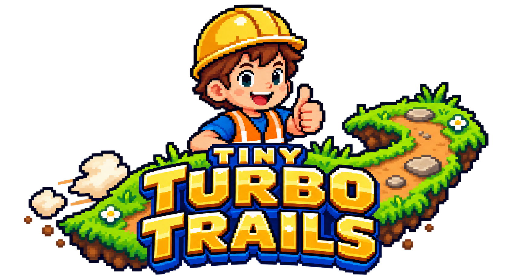

<p align="center"></p>

# Tiny Turbo Trails

A forgiving, illustrated platform game for Henry. Explore six open trails:
Plains, Quarry Run, Treetop Timbers, Sunset Site, Frost Ridge and Sandy Cove.
Choose a landmark on the overworld, collect gems and reach the finish.

## Play locally

Install Node.js 22.12 or newer, then run:

```sh
npm ci
npm run play
```

This starts Vite and opens the game. Use the URL it prints if the browser does
not open. Both `/` and `/?scene=adventure` open the playable map.
Stop the local server with Ctrl+C. An adult sets this up for local play.

For an already configured home server, open its LAN address instead; no local
development server is needed. [LAN setup and updates](docs/DEPLOYMENT.md) cover
Docker/nginx deployment and rollback. Public internet hosting is outside scope.

## Controls

| Action | Keyboard | Standard controller | Pointer |
| --- | --- | --- | --- |
| Choose trail / finish action | Left/Right or A/D | D-pad / left stick | Click landmark / action |
| Play / confirm | Space; Tab and Enter on buttons | Any face button | Play / action button |
| Move | Left/Right or A/D | D-pad / left stick | Not supported |
| Jump | Space | Any face button | Not supported |
| Pause / resume | Escape | Start | — |
| Mute | M | — | Mute button |

Replay starts the same trail fresh. Next trail starts the next registered trail;
Choose trail returns to the map. Checkpoint recovery retains gems. Completion
badges last for this page session only; reloading clears them. Nothing is saved
to browser storage or a server. See the [adventure guide](docs/plains-adventure.md).

## Develop

```sh
npm run dev           # Local server without opening a browser
npm test              # Vitest regression suite
npm run typecheck
npm run build         # Production bundle in dist/
npm run preview       # Serve the production bundle after building
npx playwright install --with-deps chromium firefox webkit
npm run test:browser  # Production-build browser checks
```

Asset-processing tests also require Python 3 (`python` on Windows, `python3`
elsewhere). The static bundle needs an HTTP server; opening `index.html` as a
local file is unsupported. No credentials or runtime generation are needed.

[Documentation index](docs/README.md) · [Requirements](docs/REQUIREMENTS.md) ·
[Art and provenance](docs/art/README.md) · [Audio](docs/AUDIO.md)

The [2026-09-17 certification](docs/RELEASE-VERIFICATION-2026-09-17.md) is historical
and does not certify later features. The [trail milestone record](docs/evidence/trail-milestone/README.md)
tracks current validation and the pending parent-led usability check.
