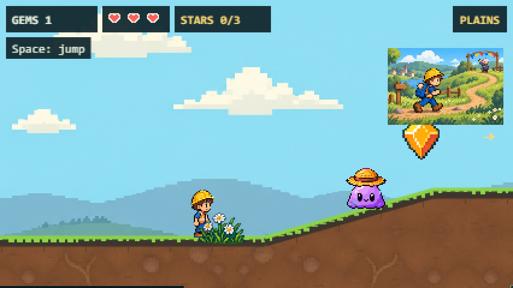
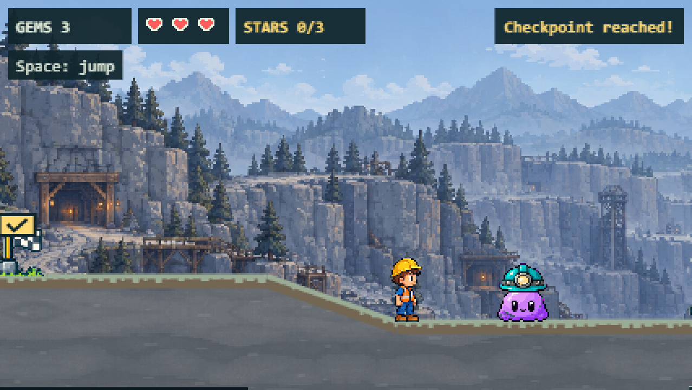
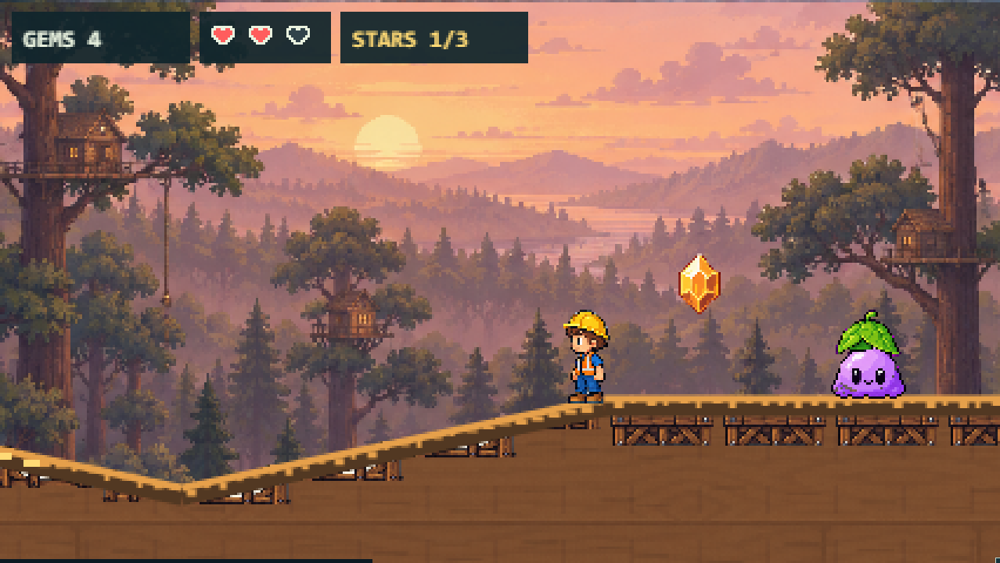
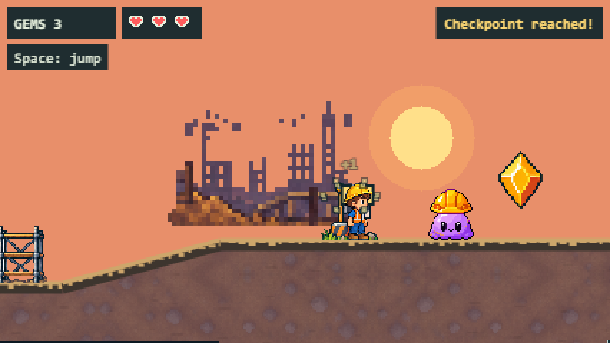
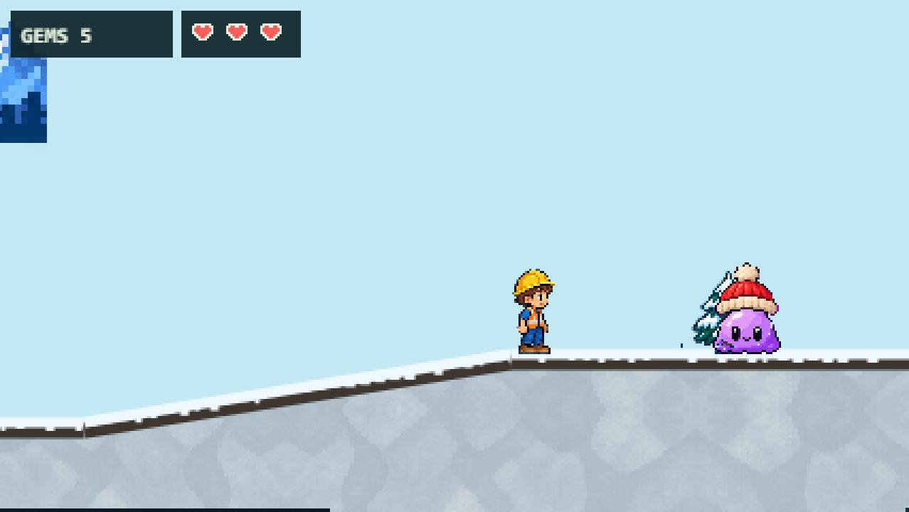
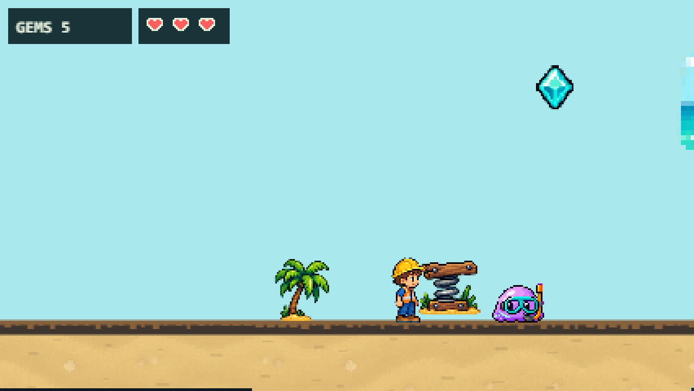

# Shared slime costumes and patrols — issue #143

All six trails now use one lavender body and face with cosmetic accessories.
Every slime walks at 36 world pixels/second, turns at the ends of a route no
longer than 120 pixels, and stays at least 20 pixels back from terrain edges.
Frost Ridge gains six slimes; Cove's three jellyfish become grounded patrols.
Sunset's first slime moves clear of the checkpoint; Quarry's last slime moves
farther beyond the final ledge landing. Tools and defeating slimes remain #142.

## Visual evidence

These screenshots were captured from actual gameplay using keyboard/pointer
input in Chromium, with the game canvas scaled from its native 426 × 240.
The common body, outlines and accessories were inspected against every biome.

| Plains: straw | Quarry: miner |
| --- | --- |
|  |  |
| Timbers: leaf | Sunset: hard hat |
|  |  |
| Frost: bobble | Cove: snorkel |
|  |  |

## Verification

- `npm test`: 546 tests passed across 32 files.
- `npm run typecheck` and `npm run build`: passed.
- Focused browser checks: all six costumes draw the shared atlas, patrol while
  Henry stands still, freeze during pause, resume, and recover from atlas-load
  failure. Chromium and WebKit: 16 passed.
- Pixel checks verify identical exposed body pixels, transparent cell borders,
  shared dimensions and exact ground baselines.
- Independent sub-agent review: no actionable findings; 141 focused unit tests
  independently passed. Snorkel overlay alignment was adjusted after visual
  inspection so the original eyes sit within the mask openings.

Local Firefox testing is blocked before page launch: the Playwright Firefox
155 executable reports a Windows side-by-side configuration error, including
after `npx playwright install --force firefox`. This is a browser launch failure,
not a passing Firefox game check. The PR's Linux CI runs all three engines.

The full browser regression result is recorded on the PR. Artwork provenance
and reproducible processing are in `assets/source/slimes/PROVENANCE.md`.
