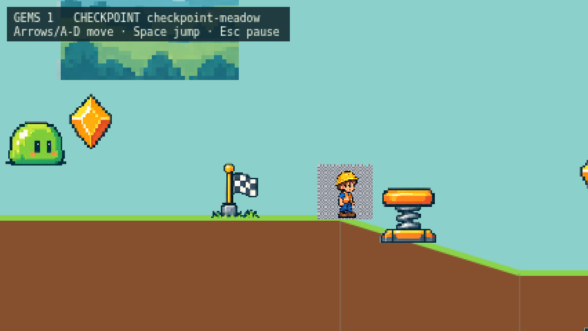
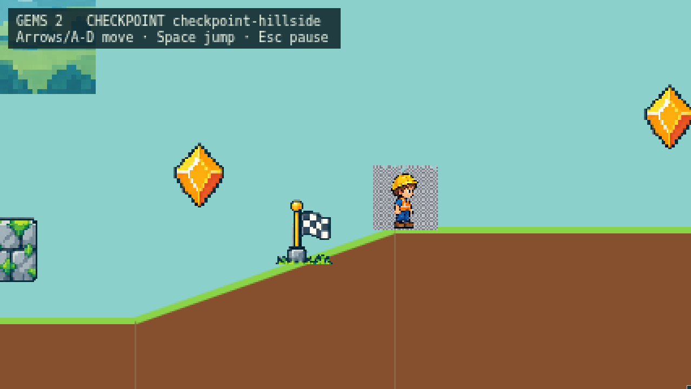
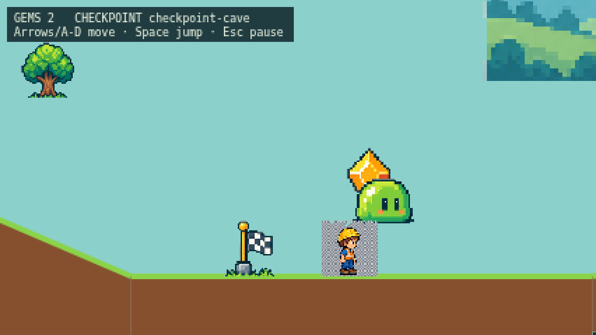

# Grounded checkpoints — issue #26

Verified on 2026-09-15 with Node 22.22.1 on Linux.

- `npm test`: 57 passed, including ground-level activation through the real
  adventure update, terrain-aligned recovery at all three checkpoints, cleared
  velocity, retained gems, and renderer anchors at two scales.
- `npm run typecheck`, `npm run build`, `git diff --check`: passed.
- `npm run test:browser -- --workers=3 --reporter=list,html`: Chromium 19 passed;
  Firefox 18 passed with one existing native-audio skip; WebKit's 19 cases could
  not launch because this host lacks required shared libraries.
- After adjusting screenshot timing so Henry does not obscure the markers,
  the checkpoint route test passed again in Chromium and Firefox.

The browser test walks across all three checkpoints, jumps over earlier route
obstacles, checks activation through the rendered HUD and verifies Henry's feet
are at terrain height when each checkpoint activates. The screenshots below were
visually inspected for base placement, including the hillside. Forced-fall
recovery is covered by simulation tests calling `recoverFromFall` with an
out-of-level player position and falling velocity; the browser test does not
force a fall. Hosted CI installs browser dependencies to cover WebKit.

## Meadow

## Hillside

## Cave

