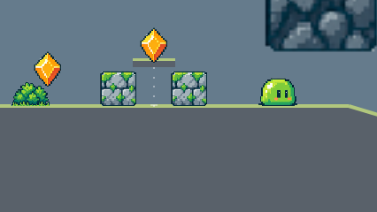
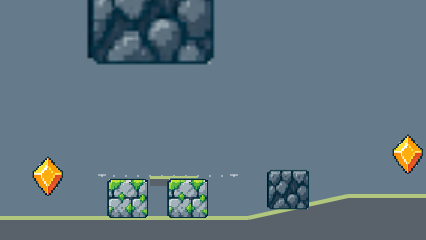

# Moving platforms — issue #37

Verified on 2026-09-17, Linux (Ubuntu 26.04 x86_64), Node 22.22.1, npm 9.2.0,
rebased onto `962e3a0` (patrolling slimes, on top of Quarry Run's six-section
rewrite). Design notes live in [docs/moving-platforms.md](../../moving-platforms.md).

## What was added

A moving platform is level data with its own collision pass, resolved after
terrain inside the existing <=4 px substeps, plus the ground velocity the
movement step lacked. Quarry Run uses two, both optional: a lift up to the stone
terraces' bonus gem and a ferry over the crusher yard's paired stone hazards.
Plains is untouched and still has no platforms.

## Design decisions

- **The spring pits keep their springs.** A ferry across a pit was built first
  and rejected: the spring guarding the approach fires across the whole walking
  band, so a player is launched over the pit before reaching any dock, and for
  about two thirds of a ferry cycle stepping off the lip would have been a fall.
  Timing a ride to avoid a pit is the wrong trade for this audience, so both
  rides dock on their section's walkable flat instead.
- **The lift shares an existing bonus gem rather than adding one.** Quarry Run's
  invariant is one jump-only bonus gem per section, so the lift was placed under
  `quarry-bonus-002` to be a second, calmer way up to it. No gem above a terrace
  can be out of a jumper's reach anyway — a full jump rises 86.7 px inside a
  28 px activation window — so the lift is documented as the forgiving way up,
  not the only way.
- **Both rides are clear of scenery.** A first placement put the lift behind a
  48 px cave decoration, which hid the deck and its gem; the browser check's
  screenshot caught it. Both rides now dock clear of the sprites around them.
- **Riders are carried by displacement, not by instantaneous velocity.** At a
  turnaround the sampled direction flips before the position moves, which dropped
  a rider on long steps. `platformBodiesAt` now reports the velocity actually
  travelled over the step, and `tickRun` clamps the run clock to the same
  `MAX_STEP_SECONDS` movement integrates.

## Validation

- `npm run typecheck`: passed.
- `npm test`: **241 passed** (18 files), up from 226 on `962e3a0`. New coverage: platform
  timing and cycle repeat, level-data validation rejections (too fast, buried,
  out of bounds, non-finite, mis-timed, duplicate), riding and carrying, one-way
  landing, buried-slab rejection, rider retention across the longest accepted
  step, jump momentum inheritance clamped in both directions, spring/knockback/
  recovery detachment, the clamped run clock, slab and path rendering, camera
  motion while riding every shipped platform, and two Quarry rides driven
  through the real `AdventureScene` — including one that starts from the
  checkpoint and boards with a tapped jump.
- `npm run build`: passed.
- Browser suite in Chromium **153.0.8010.12**, Firefox **155.0** and WebKit
  **26.6** (Playwright 1.63.0): **83 passed, 1 skipped, 0 failed**. The skip is
  the pre-existing Firefox native-audio probe; this sandbox has no audio backend.
  The preview server ran on port 4199 rather than the configured 4173, which was
  held by an unrelated checkout on the same machine; nothing else was changed.
- `git diff --check`: clean.

Quarry Run's own suite still passes unchanged: the held-right route collects
exactly the main-route gems, hits all nine springs and seven checkpoints, and
each of the six bonus gems is still collected by its single scripted jump. The
rides are optional and neither is load-bearing for finishing the level.

## Screenshots

Both frames come from the new browser check, which runs the real renderer on a
scratch canvas in Chromium so the slab and its telegraphed path are measured as
pixels, not as draw calls.

The terraces lift parked at the top of its path, between the section's two stone
hazards and under `quarry-bonus-002`. The gem sits inside the activation window
of a rider standing on the deck; the dotted line runs back down to the dock.

The crusher ferry mid-crossing, passing over the paired stone hazards it carries
riders above.

## Known limitations

Only the top face is solid: platforms cannot push, block or crush Henry, and
entities do not ride them. A player who keeps holding a direction will run off a
slab; both rides are placed so that costs a short drop onto walkable ground. A
deck passes behind entity art it crosses, such as the hazards under the ferry. No
manual play session on real hardware was run for this change.
