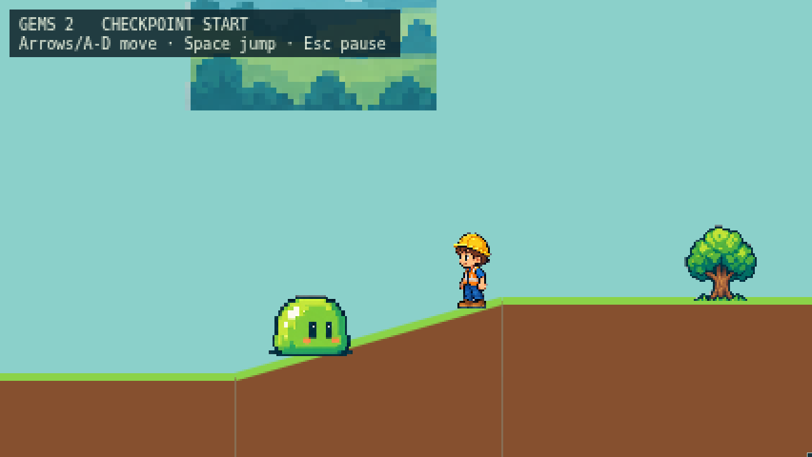

# Grounded Plains scenery and slimes — issue #47

Verified on 2026-09-16, Linux, Node 22.22.1. Baseline: `9c9095c`, which already
includes the expanded route from #45 / PR #57. The issue's original three-slime
route has been replaced by fourteen slimes and twelve scenery placements.

All scenery and slimes now derive their world Y from `surfaceY` at their X.
Their manifest anchors account for the four transparent rows beneath the
visible artwork. This includes trees, flowers, bushes, stones and cave scenery.
On slopes, the base's center contacts the terrain; sprites remain upright.

## Difficulty coordination with #45

The merged route already places slimes about 20 pixels above terrain, inside
the 28-pixel contact window. Grounding them therefore does not introduce the
three new walking contacts predicted for the older route in #47.

A deterministic comparison used the real `AdventureScene.update`, stepping at
1/60 second from a fresh title, holding Right to the finish. The jumping sample
pressed jump every 120 frames and held it for the first 15 frames of each cycle.
Damage and checkpoint counts came from the scene's audio effect events.

| Input | Baseline time | Fixed time | Damage, before → after | Gems, before → after | Checkpoints |
| --- | ---: | ---: | ---: | ---: | ---: |
| Right, no jump | 53.783 s | 53.783 s | 16 → 16 | 37 → 37 | 6 → 6 |
| Right, periodic jump | 53.500 s | 53.500 s | 15 → 15 | 36 → 36 | 6 → 6 |

Both samples finish. These are simulated machine-paced durations, not measured
child playtimes and not certification of #45's 3–5-minute target. Movement,
contact windows, invulnerability, and knockback settings are unchanged. A new
regression test walks the entire route and checks completion, every checkpoint,
and no more damage events than the authored slime/hazard count.

## Validation

- `npm test`: 106 passed. Placement tests failed for all 26 affected entities
  before the fix; renderer tests failed for all six missing base anchors.
- `npm run typecheck`, `npm run build`: passed.
- `npm run test:browser -- --workers=3 --reporter=list,html`: 68 passed, one
  existing Firefox native-audio skip. Chromium 153.0.8010.12, Firefox 155.0,
  WebKit 26.6. New grounding checks, full-route completion, and all-checkpoint
  traversals passed in all three engines.
- The grounding test was rerun in all three engines after tightening screenshot
  position polling: 3 passed; screenshots visually checked for ramp and flat contact.
- `git diff --check`: passed. Independent code review: no actionable findings.

The browser regression measures the actual atlas alpha bounds and compares
rendered sprite bases with terrain height for every scenery/slime placement.
Its screenshot frames the first slime on the ramp and the first tree on the
flat meadow. Other ground objects (springs, hazard interaction points, and the
finish arch) retain their authored placements; gems retain their pickup heights.

## Screenshots

[Firefox](firefox-grounded-slime-and-tree.png) · [WebKit](webkit-grounded-slime-and-tree.png)
