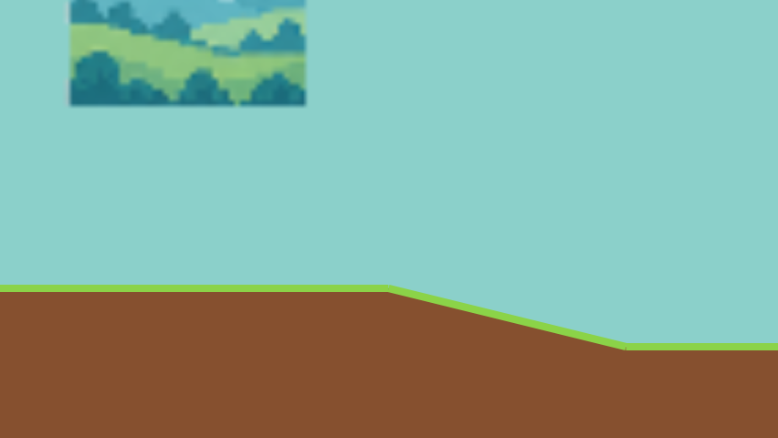

# Terrain join regression evidence

Issue: [#48](https://github.com/auleewilliams/TinyTurboTrails/issues/48).

The renderer now fills each connected sequence of ground surfaces as one contour.
This removes internal antialiased edges without rounding coordinates or changing
the level's collision geometry. Disconnected surfaces still get separate fills.

`terrain-join-650.png` was captured on 2026-09-16 by the Playwright terrain-join
regression in Chromium 153.0.8010.12. It shows the real world renderer at camera
X=437.25 and 2× canvas scale, with entities hidden to expose the dirt fill.
The flat-to-downhill join at world X=650 is centered in the image.

The pixel check covers all 54 joins at scales 1, 1.25, 1.5 and 2. Each join is
sampled over 12 frames in each direction, advancing the camera by maximum player
speed / 60 per frame from a fractional offset (5,184 rendered frames per browser).
It checks a strip below the ground for opaque dirt pixels. It failed against the
original renderer with lighter pixels, then passed in Chromium, Firefox and
WebKit with the fix. These are controlled renderer checks, not simulated player
traversals or operating-system display-scale changes.

Validation: `npm test` (74 passed), `npm run typecheck`, `npm run build`, and
`npm run test:browser` (68 passed, one existing Firefox Web Audio test skipped).
The full browser suite includes playable-route completion and checkpoints.

